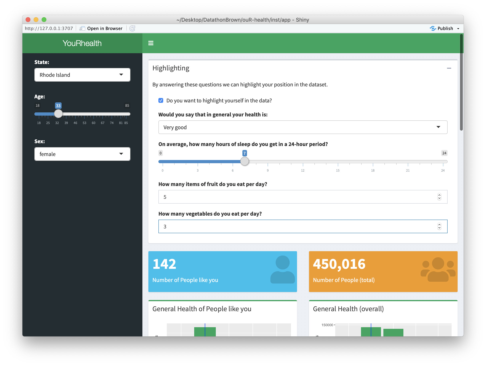
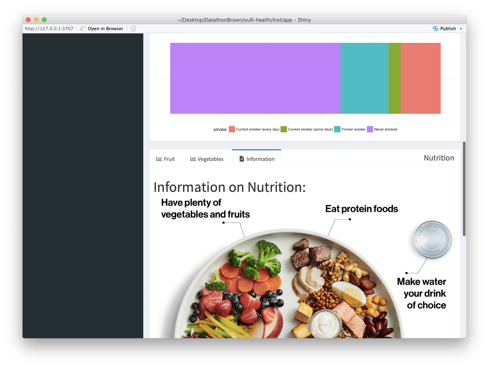

#  YouRhealth

*Promoting a healthy you: How does your health line up with those in your demographics?*

## How you run it 

Just clone or copy the code from github, install the following packages: `shinydashboard`, `tidyverse`, `shiny`, `foreign` and 
copy over the data from [the CDC website](https://www.cdc.gov/brfss/annual_data/annual_2017.html) in stata format and place it as `LLCP2017.XPT` in the project's folder (remember to remove the space at the end of the filename in the download). Then navigate into `inst/app/ui.R` (in rstudio) and simply press the "Run App" button. 
## What it does
YouR-Health is a web app that plots user's health factors to help them visualize and comprehend their habits. Utilizing CDC data, our platform shows users nutrition intake, stress, smoking, and sleep habits of others in their demographic. Through these visualizations, users can plot where they stack up and identify potential areas in which they can improve their health.
## How we built it
Our team utilized R, a powerful data-computing language that many of us had familiarity with through our backgrounds in the humanities. The Shiny package allowed us to create a GUI interface and strong visuals.   
## Challenges we ran into
Initially we struggled working through the dataset in identifying correlation with causation. Further we questioned whether we could build a useful tool without follow-up survey data. Ultimately, we solved these problems by choosing very specific independent and dependent variables that had explanatory power without followup data. Another major challenge we ran into was cleaning the CDC data-- many of the variables were coded in manners that made for difficult analysis. We therefore had to spend a large portion of our time cleaning the data within RStudio.
## Accomplishments that we're proud of
Our team begun this Hackathon as a diverse group of humanities majors with little data science background. With academic backgrounds in psychology, computer science, and economics we knew from the get-go that we would struggle to coordinate tasks to be in alignment with our individual skillsets. In the end, everyone learned a lot in creating a project that we are all proud of.